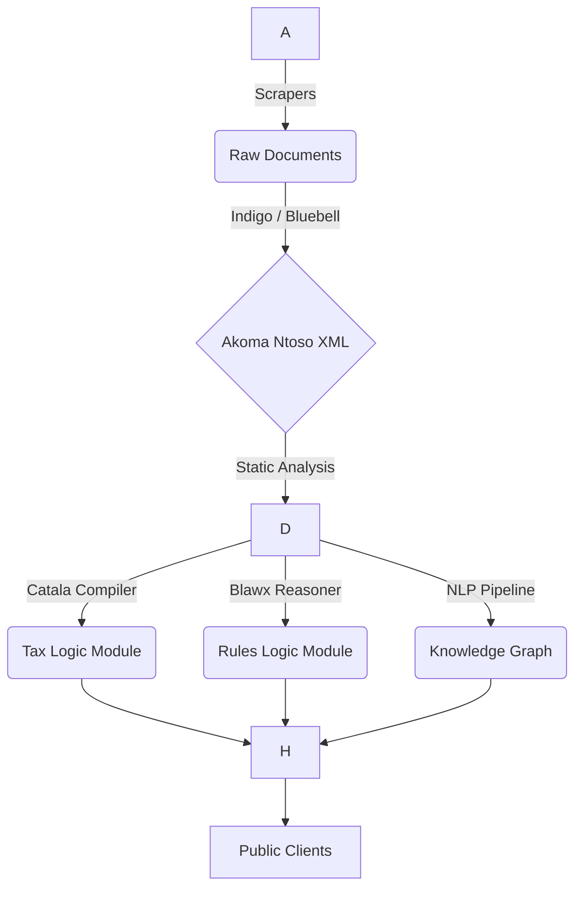

# 🏛️ ARCHITECTURE.md - System Design & Data Flow

> **SYSTEM NOTICE:** This document defines the structural integrity of the "Leyes Como Código" platform. All architectural decisions must align with the **Separation of Concerns** principle: The *Text* of the law is immutable data; the *Logic* of the law is executable code.

---

## 1. High-Level Overview

The architecture follows a unidirectional data flow pipeline, transforming unstructured government publications into structured, queryable, and executable artifacts.

---

## 2. Directory Structure (The Monorepo)

This repository is a **Polyglot Monorepo**. Agents must respect the specific language environments of each directory.

/
├──.github/                 # CI/CD Workflows (Validation, Testing)
├── apps/
│   ├── indigo/              # CMS for managing Akoma Ntoso files (Django)
│   ├── api/                 # The Public REST/GraphQL API (FastAPI)
│   └── viewer/              # Static frontend for reading the law (React/Next.js)
│
├── data/
│   ├── federal/             # The "Git for Law" - Federal Akoma Ntoso XMLs
│   ├── state/               # State-level Akoma Ntoso XMLs (e.g., /state/nl)
│   └── ontology/            # OWL/RDF definitions of Mexican Legal Concepts
│
├── engines/
│   ├── catala/              # Tax algorithms (File extension:.catala_en)
│   ├── blawx/               # Logical rules (File extension:.blawx)
│   └── openfisca/           # Python wrappers for microsimulation
│
├── scrapers/                # Python spiders (Juriscraper) for DOF/OJN
│
├── tools/
│   ├── parser/              # Custom Bluebell configurations for Mexican Spanish
│   └── linter/              # XML Schema validators
│
├── AGENTS.md
├── ARCHITECTURE.md
└── TECH_STACK.md

---

## 3. Layer 1: The Structural Layer (Akoma Ntoso)

This is the single source of truth. We use the **OASIS Akoma Ntoso V3.0** standard.

### 3.1 Naming Convention (FRBR URIs)

We adhere to the Functional Requirements for Bibliographic Records (FRBR) naming convention for unique identifiers.

**Format:** `/mx/{jurisdiction}/{type}/{date}/{title}/{language}@{version}`

* **Jurisdiction:** `fed` (Federal), `cdmx` (Ciudad de México), `nl` (Nuevo León).
* **Type:** `ley` (Law), `reglamento` (Regulation), `const` (Constitution).
* **Date:** ISO format `YYYY-MM-DD` of the *original publication*.
* **Title:** Acronym or short slug (e.g., `lisr`, `cpeum`).

**Example URIs:**

* **Constitution:** `/mx/fed/const/1917-02-05/cpeum/es@2024-05-01.xml`
* **Income Tax Law:** `/mx/fed/ley/2013-12-11/lisr/es@2024-01-01.xml`

### 3.2 Metadata Requirements

Every XML file must contain a `<meta>` block defining:

* `lifecycle`: The history of reforms (Decretos) that modified this text.
* `analysis`: Active and passive modifications (e.g., "This article derogates Article X of Law Y").

---

## 4. Layer 2: The Logic Layer (Executable Code)

Code in this layer is **derived** from Layer 1. It is not the law; it is a *representation* of the law.

### 4.1 Catala (Fiscal Logic)

* **Location:** `/engines/catala/`
* **Mapping:** One `.catala` file per Title or Chapter of a tax law.
* **Output:** The Catala compiler generates a Python module inside `/engines/openfisca/`.
* **Constraint:** You cannot manually edit the generated Python files. You must edit the `.catala` source.

### 4.2 Blawx (General Rules)

* **Location:** `/engines/blawx/`
* **Mapping:** Used for logic that requires "Defeasible Reasoning" (rules with exceptions).
* **Execution:** Blawx exports to **s(CASP)** (Prolog), which runs via a Python bridge in the API.

---

## 5. Layer 3: The Semantic Layer (Knowledge Graph)

* **Location:** `/data/ontology/`
* **Ontology File:** `mexico-legal.owl`
* **Purpose:** To define relationships that are not explicit in the text.
* *Example:* `Sat` `is_a` `DecentralizedOrgan` `subordinate_to` `SHCP`.

* **NLP Pipeline:**
* When a new law is ingested, the NLP pipeline scans it for entities defined in the Ontology.
* It injects `refersTo="#id"` attributes into the Akoma Ntoso XML, linking the text to the Knowledge Graph.

---

## 6. The API Layer (The "State API")

The API does not store data; it queries the XML and executes the Engines.

* **Endpoint A: Content** (`GET /law/{id}`)
* Returns the Akoma Ntoso XML or rendered HTML.

* **Endpoint B: Calculation** (`POST /calculate/{law_id}`)
* Accepts a JSON payload of variables (e.g., Income, Expenses).
* Routes the request to the compiled Catala/OpenFisca module.
* Returns the result + a "Trace" explaining which articles were applied.

---

## 7. Versioning Strategy

* **Git Branches:**
* `main`: The current valid law.
* `history/{year}`: Snapshots of the law as it existed in past years.

* **Tagging:**
* Every publication in the DOF triggers a Git Tag: `dof-YYYY-MM-DD`.

**Agent Note:** When asked to "update the law," you are performing a **Consolidation**. You must apply the changes from the reform decree to the main text, creating a new version of the XML file.
